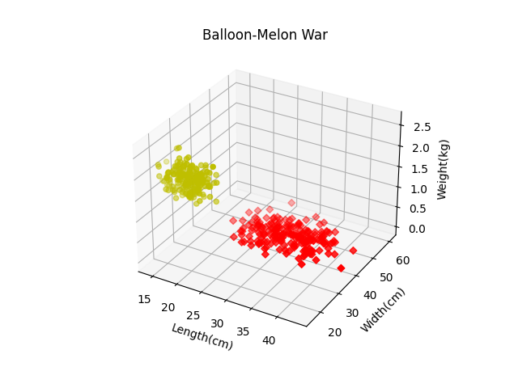

# 1- Sololearn-Python for Data Science Certificate

# 2- Apples 🍎 and bananas 🍌 data analysis problem

- Outputs are available in its .ipynb file.

# 3- Balloons 🎈 and melons 🍈 problem using three features: length, width and weight.

# 4- California cities problem.

